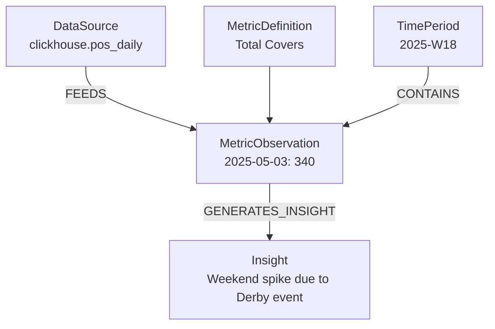

# Simplified Graph-Based Understanding Layer (MVP)

## 1. Overview

This MVP version defines a simplified **understanding layer** that connects metrics, data sources, and insights in a conceptual three-tier model — **Cold (data)**, **Warm (metrics)**, and **Hot (insights)**.
The tiers are **conceptual**, not physical. The graph serves as a **semantic reasoning cache**, not a data warehouse.

| Tier             | Purpose                           | Backing System                     |
| ---------------- | --------------------------------- | ---------------------------------- |
| 🧊**Cold** | Raw data, logs, tables            | ClickHouse, Redshift, Spark, files |
| 🌤**Warm** | Simple metric aggregations        | Aggregation engine or ETL jobs     |
| 🔥**Hot**  | Insights, anomalies, correlations | Graph reasoning layer              |

---

## 2. Core Concepts

The graph layer stores **semantic relationships**, **temporal structure**, and **lineage** of metrics and insights, while the data itself lives in existing systems.

### Key Goals

- Maintain **semantic continuity** across data sources.
- Enable **temporal and causal reasoning** without replicating raw data.
- Provide **LLM/agent access** to high-quality structured context.

---

## 3. Core Node Types

| Node                  | Description                                                             |
| --------------------- | ----------------------------------------------------------------------- |
| `DataSource`        | Reference to external table or dataset (Cold Tier pointer)              |
| `MetricDefinition`  | Defines what a metric means (semantic contract)                         |
| `MetricObservation` | Aggregated metric for a time window (Warm Tier)                         |
| `Insight`           | Interpreted conclusion derived from one or more observations (Hot Tier) |
| `TimePeriod`        | Optional helper node for temporal grouping                              |

---

## 4. Core Edge Types

| Edge                            | From → To                             | Meaning                                |
| ------------------------------- | -------------------------------------- | -------------------------------------- |
| `FEEDS`                       | DataSource → MetricObservation        | Observation is computed from this data |
| `DERIVED_FROM`                | MetricObservation → MetricObservation | Derived metric relationship            |
| `GENERATES_INSIGHT`           | MetricObservation → Insight           | Observation produces insight           |
| `CONTAINS`                    | TimePeriod → MetricObservation        | Groups observation by period           |
| *(optional)* `ABOUT_METRIC` | Insight → MetricDefinition            | Insight context for metric             |

---

## 5. Simplified Temporal Model

Instead of multiple temporal node types, the MVP stores **time metadata** directly on `MetricObservation`:

```json
{
  "id": "obs_peak_breakfast_2025_05_03",
  "metric": "total_covers",
  "dims": {"restaurant": "Peak", "meal": "breakfast"},
  "time_start": "2025-05-03",
  "time_end": "2025-05-03",
  "period_label": "2025-W18",
  "value": 340,
  "confidence": 0.85
}
```

Future versions can promote trends or seasonality into separate nodes.

---

## 6. Simplified Retrieval Flow

1. **Agent parses question** (e.g. “Why did staff efficiency drop last week?”).
2. **Resolve metric** → find related `MetricDefinition` and recent `MetricObservation`s.
3. **Traverse** any `DERIVED_FROM` or `GENERATES_INSIGHT` relationships.
4. **Aggregate context** into structured JSON for LLM summarization.

This single traversal replaces multi-tier lookups for simplicity.

---

## 7. Example Graph



---

## 8. Scalability Principles

| Principle                                 | Description                                |
| ----------------------------------------- | ------------------------------------------ |
| **Graph = understanding layer**     | Store semantics, not data points           |
| **One model, many engines**         | Integrate with ClickHouse, Spark, Redshift |
| **Temporal = metadata**             | Model trends later as insights             |
| **Flat graph first**                | Add caching tiers only when needed         |
| **Reasoning density > data volume** | Prioritize relationships and meaning       |

---

## 9. Roadmap

| Phase             | Focus              | Description                                       |
| ----------------- | ------------------ | ------------------------------------------------- |
| **Phase 1** | MVP graph          | Minimal node/edge schema, single traversal agent  |
| **Phase 2** | Composite metrics  | Add derived metric definitions and dependency DAG |
| **Phase 3** | Insights expansion | Add anomaly, correlation, and forecasting nodes   |
| **Phase 4** | Performance tuning | Introduce materialization tiers if needed         |

---

## 10. Summary

This MVP design provides a **lean but powerful reasoning layer**.
It focuses on *understanding*, *lineage*, and *temporal semantics*, while delegating data storage and aggregation to the right engines.
Future iterations can expand complexity naturally without refactoring the foundation.
