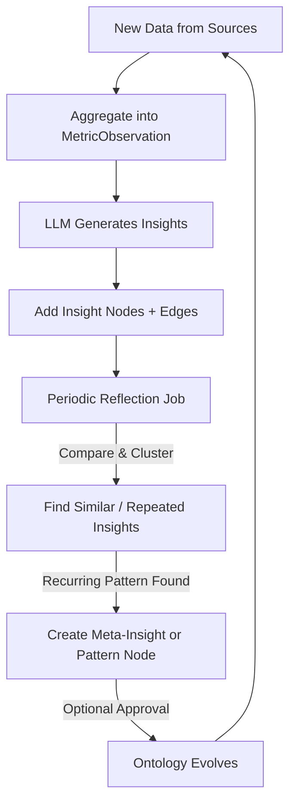
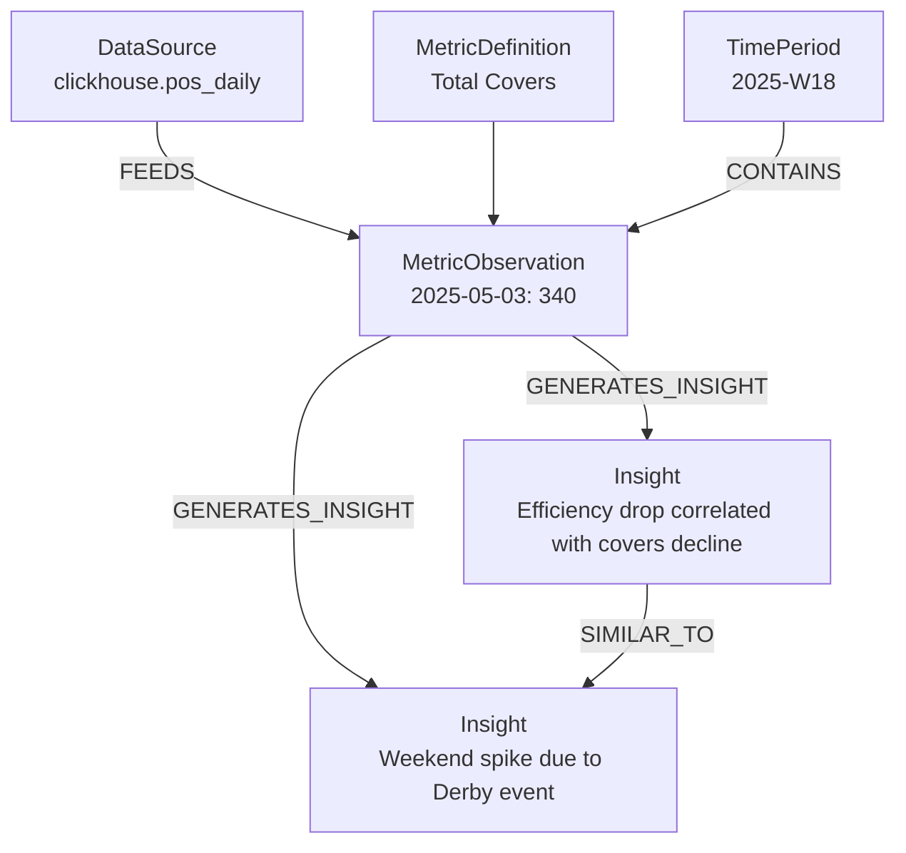

# Simplified Graph-Based Understanding Layer (MVP + Insight Reflection Loop)

## 1. Overview

This MVP defines a **graph-based understanding layer** that connects metrics, data sources, and insights across a conceptual three-tier model — **Cold**, **Warm**, and **Hot**.  
The tiers are **conceptual**, not physical databases. The graph serves as a **semantic reasoning cache**, not a data warehouse.

| Tier | Purpose | Backing System |
|------|----------|----------------|
| 🧊 **Cold** | Raw data and events | ClickHouse, Redshift, Spark, files |
| 🌤 **Warm** | Simple metric aggregations (e.g., daily totals) | ETL or aggregation engine |
| 🔥 **Hot** | Insights, anomalies, correlations | Graph reasoning layer |

The LLM-based agent reasons over the graph to derive new insights, validate past ones, and evolve the understanding model over time.

---

## 2. Core Concepts

The graph stores **semantic relationships**, **temporal structure**, and **lineage** of metrics and insights, while the data itself lives in existing data systems.

### Key Goals
- Maintain **semantic continuity** across domains and sources.  
- Enable **temporal and causal reasoning** over metrics.  
- Allow **continuous insight discovery** and **graph self-growth** through the LLM.  

---

## 3. Core Node Types

| Node | Description |
|------|--------------|
| `DataSource` | Pointer to external data (Cold Tier) |
| `MetricDefinition` | Defines a measurable concept (semantic contract) |
| `MetricObservation` | Aggregated metric for a time window (Warm Tier) |
| `Insight` | Interpreted or generated conclusion (Hot Tier) |
| `TimePeriod` | Optional grouping node for temporal reasoning |

---

## 4. Core Edge Types

| Edge | From → To | Meaning |
|------|------------|---------|
| `FEEDS` | DataSource → MetricObservation | Observation computed from data |
| `DERIVED_FROM` | MetricObservation → MetricObservation | Derived metric lineage |
| `GENERATES_INSIGHT` | MetricObservation → Insight | Observation leads to insight |
| `CONTAINS` | TimePeriod → MetricObservation | Period contains observation |
| *(optional)* `ABOUT_METRIC` | Insight → MetricDefinition | Insight context for metric |

---

## 5. Simplified Temporal Model

Time is modeled as metadata within each `MetricObservation` node rather than as complex temporal structures.

```json
{
  "id": "obs_peak_breakfast_2025_05_03",
  "metric": "total_covers",
  "dims": {"restaurant": "Peak", "meal": "breakfast"},
  "time_start": "2025-05-03",
  "time_end": "2025-05-03",
  "period_label": "2025-W18",
  "value": 340,
  "confidence": 0.85
}
```

Later versions can promote trends or seasonality to first-class nodes if persistent patterns emerge.

---

## 6. Insight Reflection Loop — Continuous Discovery Mechanism

Even with a minimal schema, the system continuously evolves its understanding via the **Insight Reflection Loop**.  
This loop allows the LLM to **generate**, **compare**, and **connect** insights over time, enabling autonomous graph growth.

### Phases of the Loop

1. **Data Ingestion:**  
   New facts arrive from cold sources → aggregated into `MetricObservation` nodes.

2. **Insight Generation:**  
   LLM analyzes recent observations and creates `Insight` nodes (e.g., “Efficiency dropped when covers decreased”).

3. **Graph Update:**  
   The new insight is linked to contributing metrics and observations using `GENERATES_INSIGHT` and `DERIVED_FROM` edges.

4. **Insight Reflection (Periodic Job):**  
   - Review recent insights.  
   - Compare semantic similarity across existing insights.  
   - Link related ones with `SIMILAR_TO` or `CONFIRMS`.  
   - Identify recurring patterns → propose generalized insights or new relation types.

5. **Ontology Evolution (Optional Human-in-the-loop):**  
   - If new relationships or patterns repeat consistently, formalize them in the ontology (e.g., add `CORRELATES_WITH`).

---

### Insight Reflection Loop — Process Diagram



This closed-loop process enables **emergent reasoning** — the graph gets smarter over time,  
without schema explosion or manual ontology engineering.

---

## 7. Example Graph



---

## 8. Scalability and Growth Principles

| Principle | Description |
|------------|-------------|
| **Graph = reasoning cache** | Stores semantics and lineage, not data points |
| **Continuous discovery** | LLM regularly generates and reflects on insights |
| **No fixed pattern types** | Patterns emerge through repeated insights |
| **Schema stability** | Start lean; ontology evolves only when repetition proves value |
| **Reasoning density > data volume** | Focus on meaningful relationships, not scale first |

---

## 9. Simplified Retrieval Flow

1. **User query →** “Why did staff efficiency drop last week?”  
2. **Resolve metric →** find related `MetricDefinition` and `MetricObservation`.  
3. **Traverse insights →** connected `Insight` nodes explain the reasoning.  
4. **Summarize →** structured response for LLM output.

This single traversal is sufficient for MVP reasoning and explainability.

---

## 10. Roadmap

| Phase | Focus | Description |
|-------|--------|-------------|
| **Phase 1** | MVP graph | Minimal schema + reflection loop + insight generation |
| **Phase 2** | Derived metrics | Add `CompositeMetricDefinition` and dependency DAG |
| **Phase 3** | Advanced insights | Introduce anomaly/correlation/forecasting nodes |
| **Phase 4** | Ontology governance | Manage evolving relationships and validation |

---

## 11. Summary

This MVP provides a **foundation for emergent understanding**:  
- The LLM generates insights from metric changes.  
- The graph records reasoning and lineage.  
- The reflection loop continuously discovers and generalizes insights.  

Even with minimal node and edge diversity, the system **grows naturally** into a self-learning knowledge graph —  
balancing simplicity, scalability, and evolving intelligence.
