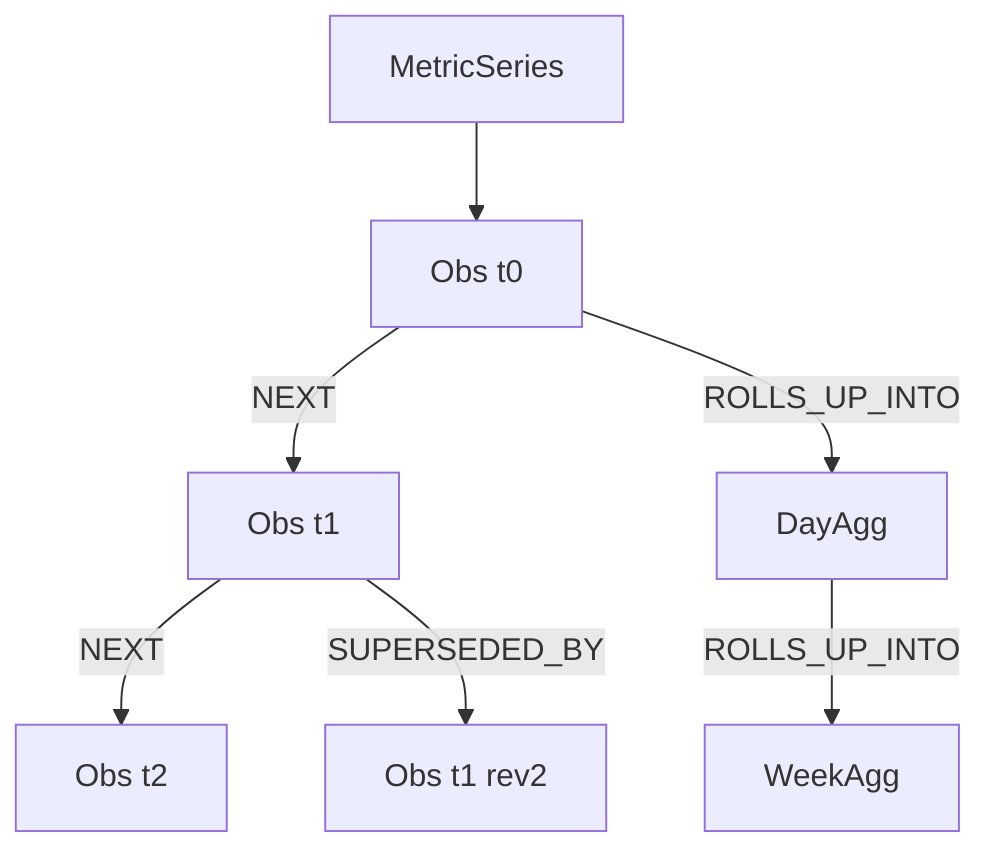
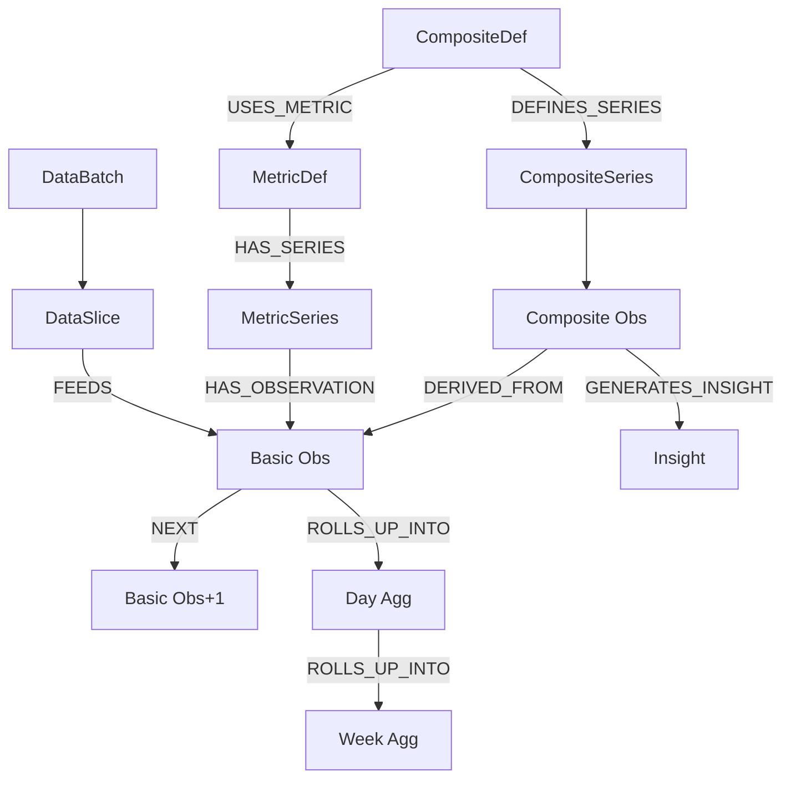
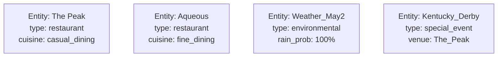
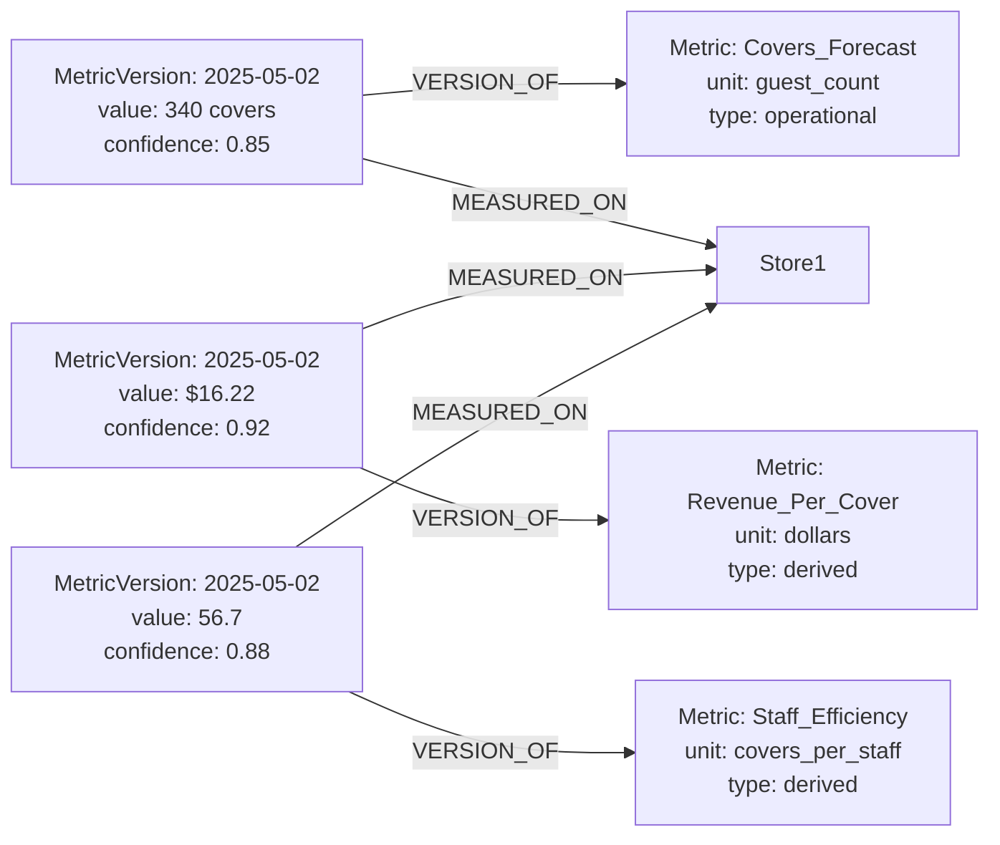
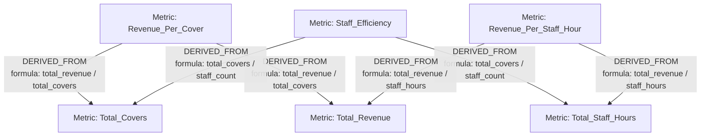
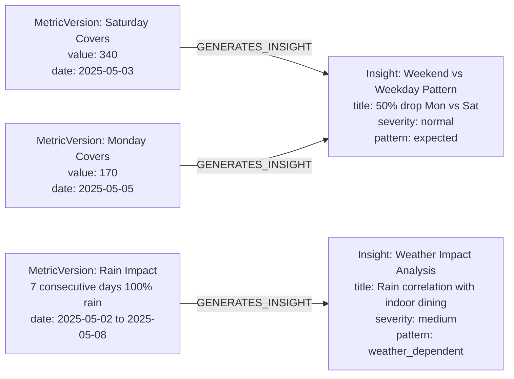
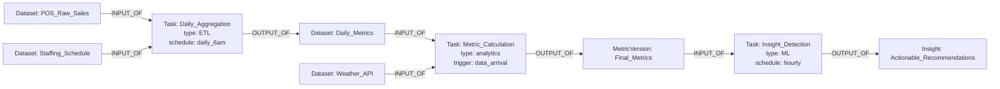
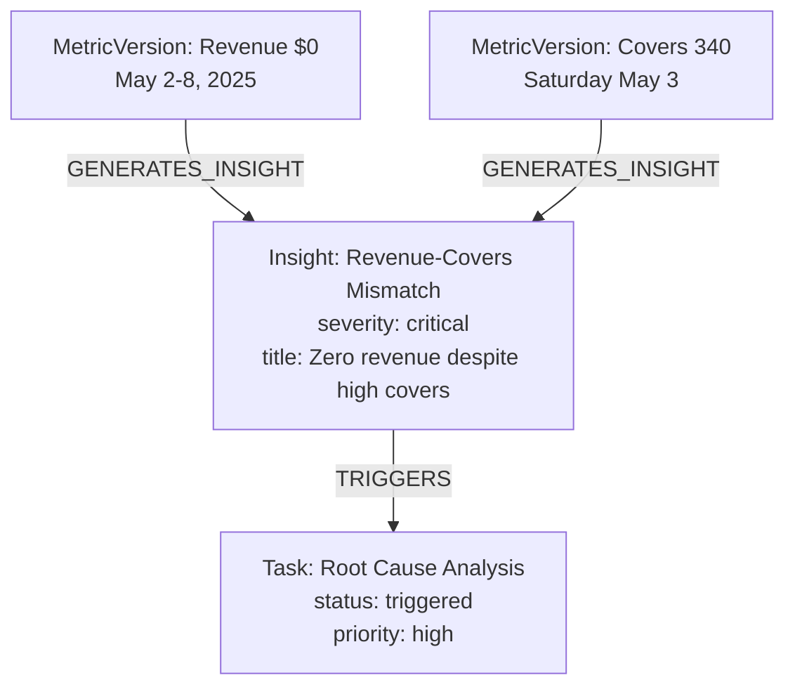
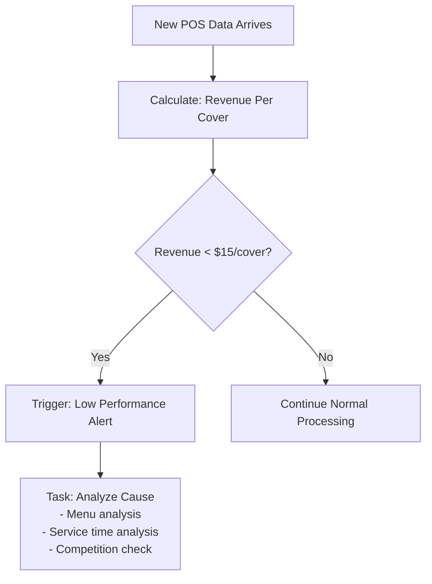

# Understanding Layer — Generic Graph-Based System Design

## 1. Overview

This system is an **understanding layer** on top of evolving business data.
It uses a **graph database** to represent entities, metrics, lineage, and insights, allowing agents/LLMs to reason about data, derive new metrics, and detect anomalies.

---

## 2. Refined Layered Model (Addressing Data + Metric Evolution)

Your operational reality (multi-grain, multi-dimensional, derived + composite metrics) requires *three semantic layers* plus an operational/meta layer:

| Layer | Node Types | Purpose |
|-------|------------|---------|
| 0. Raw / Facts | DataBatch, DataSlice | Capture ingested mini-batches & normalized fact slices (e.g. (venue=Peak, date=2025-05-03, meal=BREAKFAST) covers=340) |
| 1. Metric Semantics | MetricDefinition, MetricSeries, MetricObservation | Define, identify, and store evolving metric time series (basic + composite) |
| 2. Derived Knowledge | CompositeMetricDefinition, Insight, Anomaly, Correlation | Higher-order reasoning outputs and interpretive artifacts |
| Ops / Lineage | Transformation, SourceFile (optional) | (Optional) external processing context if needed |

### 2.1 Core Node Types (Updated)
| Node | Key Props | Notes |
|------|-----------|-------|
| DataBatch | id, arrived_at, source_type | One ingestion unit (mini-batch) |
| DataSlice | id, dims:{restaurant, date, meal, role?}, time_start, time_end, raw_attrs:{} | Atomized fact at a grain |
| MetricDefinition | id, name, granularity, dimension_schema[], type ('basic'/'composite'), version | Semantic contract |
| MetricSeries | id (hash(def + dims signature)), dims_signature, granularity | Stable identity for a time series |
| MetricObservation | id, value, time_start, time_end, revision, quality:{...} | One point in a series |
| CompositeMetricDefinition | id, expression_dsl, output_granularity | Formula tree referencing MetricDefinitions |
| Insight | id, kind, severity, summary, created_at | Human / algorithm narrative anchor |
| Anomaly | id, zscore, expected, delta_pct | Specialized insight seed |
| Correlation | id, window, r_value, p_value | Relationship between series |

### 2.2 Edge Types (Updated)
| Edge | From → To | Purpose |
|------|-----------|---------|
| CREATED | DataBatch → DataSlice | Batch membership |
| FEEDS | DataSlice → MetricObservation | Raw fact contributes to observation |
| HAS_SERIES | MetricDefinition → MetricSeries | Definition → logical series |
| HAS_OBSERVATION | MetricSeries → MetricObservation | Series membership |
| NEXT | MetricObservation → MetricObservation | Temporal chain within a series |
| ROLLS_UP_INTO | MetricObservation → MetricObservation | Hierarchical temporal aggregation (day→week) |
| SUPERSEDED_BY | MetricObservation → MetricObservation | Revision lineage |
| GENERATES_INSIGHT | MetricObservation → Insight | Observation produced insight |
| USES_METRIC | CompositeMetricDefinition → MetricDefinition | Dependency graph (semantic) |
| DEFINES_SERIES | CompositeMetricDefinition → MetricSeries | Output binding |
| DERIVED_FROM | MetricObservation → MetricObservation | Fine-grain lineage (optional) |
| ABOUT_METRIC_SERIES | Insight → MetricSeries | Insight attachment |
| ON_OBSERVATION | Anomaly → MetricObservation | Anomaly target |
| BETWEEN | Correlation → MetricSeries | Correlated pair(s) |

---

## 3. Temporal & Hierarchical Linking
**Why NOT only timestamps?** We need fast window queries, revision handling, and rollups.

Mechanisms:
1. `:NEXT` provides an ordered singly-linked list per `MetricSeries` (fast recent traversal, incremental append).
2. `:ROLLS_UP_INTO` links fine-grain observations to their aggregates (e.g., each breakfast observation → that day aggregate → that week aggregate).
3. `:SUPERSEDED_BY` preserves correctness when late data arrives (agents ignore superseded nodes).
4. Optional materialized pointers: store `latest_obs_id` on `MetricSeries` for O(1) head fetch.

Mermaid (condensed):


---

## 4. Composite Metric Mechanics
Composite definitions reference *definitions*, not observations. Runtime expands to current observations.

Flow for computing a composite observation:
1. Resolve dependency DAG via `:USES_METRIC` edges.
2. For each dependency series, fetch aligned observations in target window.
3. Compute value; create new `MetricObservation` under the composite `MetricSeries`.
4. (Optional) Link via `:DERIVED_FROM` to source observations for explainability.
5. (Optional) Attach lightweight provenance properties on the observation itself (e.g. `ingestion_id`, `pipeline_label`).

Selective Recompute Trigger:
```
MATCH (md:MetricDefinition)<-[:USES_METRIC]-(cmp:CompositeMetricDefinition)
WHERE md.id IN $changed_basic_metrics
RETURN DISTINCT cmp;
```

---

## 5. Ingestion & Mini‑Batch Lifecycle
1. Create `DataBatch`.
2. Normalize rows → `DataSlice` nodes (`MERGE` to avoid duplication by (dims,time_range)).
3. For each basic `MetricDefinition`: aggregate relevant slices → create new `MetricObservation`s.
4. Link `:NEXT` from prior head(s).
5. Mark changed base metrics; enqueue composite recomputation set.
6. Run composite engine; then anomaly / correlation detectors.
7. Emit `Insight` nodes for material changes.

Error / Late Data Handling:
- Insert replacement observation → link old `:SUPERSEDED_BY` new.
- Trigger recompute only for affected windows (bounded by observation time_start).

---

## 6. Lineage & Explainability Paths
Backward (WHY?): Observation → `DERIVED_FROM` → source observations → `FEEDS` → raw DataSlices.
Forward (IMPACT?): Observation ← `DERIVED_FROM`* ← composite observations ← Insights.

Minimal explanation query sketch:
```cypher
// Upstream factors for a composite observation
MATCH (co:MetricObservation {id:$id})-[:DERIVED_FROM]->(src:MetricObservation)
OPTIONAL MATCH (src)<-[:FEEDS]-(ds:DataSlice)
RETURN co, collect(distinct src) as inputs, collect(distinct ds) as raw_sources;
```

---

## 7. Retrieval Pattern for LLM / Agent
Steps when a user asks: *"Why did staff efficiency drop?"*
1. Resolve target `MetricDefinition` by name embedding / alias.
2. Fetch `MetricSeries` for dimension signature (restaurant, meal, date range).
3. Pull recent observation chain via `:NEXT` (limit N) excluding superseded.
4. Traverse `:DERIVED_FROM` one hop for decomposition.
5. Fetch any recent `Insight` / `Anomaly` via `:ABOUT_METRIC_SERIES` / `:ON_OBSERVATION`.
6. Return structured JSON (values, deltas, inputs, anomalies) for natural language summarization.

---

## 8. Mermaid Schema (Condensed End‑to‑End)


---

## 9. Advantages vs Prior Version
| Concern | Old Design | Refined Design |
|---------|------------|----------------|
| Multi-dimensional facts | Forced into generic Entity+MetricVersion | Explicit DataSlice with dims map |
| Temporal chaining | Implicit by dates | Explicit `:NEXT`, rollups, revisions |
| Composite clarity | Edge formulas on Metrics | Dedicated CompositeMetricDefinition + expression_dsl |
| Selective recompute | Hard to scope | Reverse dependency traversal via `:USES_METRIC` |
| Explainability | Limited | `DERIVED_FROM` + `FEEDS` + provenance |
| Late data | Overwrite or duplicate | `:SUPERSEDED_BY` chain |
| Agent retrieval | Ad hoc | Structured retrieval pipeline |

---

## 10. Implementation Phasing (Actionable)
Phase 1: Definitions, Series, Observations, NEXT chain, ingestion pipeline.
Phase 2: CompositeMetricDefinition engine + dependency graph + selective recompute.
Phase 3: Rollups (`:ROLLS_UP_INTO`), anomalies, insights, supersession.
Phase 4: Correlations, forecasting, optimization (caching & pruning old fine-grain observations).

---

## 11. Trade‑Offs & Mitigations
| Risk | Impact | Mitigation |
|------|--------|------------|
| Observation explosion | Storage & traversal cost | TTL + rollup retention + compress superseded |
| Cyclic composite defs | Infinite recompute | Cycle detection on `:USES_METRIC` commit |
| High fan-out dependency updates | Compute lag | Batch recompute queue + window scoping |
| Late-arriving corrections | Inconsistent views | Revision chain + recompute delta windows |
| Agent over-fetch | Prompt noise | Curated retrieval (recent N + anomalies + dependency cone) |

---

## 12. (Legacy Sections Below Retained for Concrete Example Reference)
The following original example section is preserved to illustrate the model against real Nemacolin data.

---

## 11. Concrete Example: Nemacolin Resort Analysis

### Real Data Context
Based on Nemacolin Resort's F&B operations data (May 2-8, 2025), here's how the system works:

#### A. Entity Nodes


#### B. Metric Definitions & Values


#### C. Derived Metrics Dependencies


#### D. Real Insight Generation


#### E. Data Lineage Example


### Real Business Questions the System Can Answer

#### 1. **Staffing Optimization Query**
> *"Why did The Peak need 3 servers on Saturday but only 1 on Monday?"*

**Graph Traversal:**
```cypher
MATCH (venue:Entity {name:"The Peak"})<-[:MEASURED_ON]-(covers:MetricVersion)-[:VERSION_OF]->(m:Metric {name:"Total_Covers"})
WHERE covers.valid_from >= date("2025-05-03") AND covers.valid_from <= date("2025-05-05")
MATCH (venue)<-[:MEASURED_ON]-(staff:MetricVersion)-[:VERSION_OF]->(sm:Metric {name:"Server_Count"})
WHERE staff.valid_from = covers.valid_from
RETURN covers.valid_from, covers.value as covers, staff.value as servers, (covers.value/staff.value) as covers_per_server
```

**System Response:** *"Saturday had 340 covers requiring 3 servers (113 covers/server), while Monday had 170 covers with 1 server (170 covers/server). The efficiency ratio suggests Monday was understaffed by 1 server for optimal service."*

#### 2. **Weather Impact Analysis**
> *"How did the 7-day rain streak affect our outdoor dining venues?"*

**Graph Traversal:**
```cypher
MATCH (w:Entity {type:"weather"})<-[:RELATES_TO]-(venue:Entity {type:"restaurant"})
MATCH (venue)<-[:MEASURED_ON]-(covers:MetricVersion)-[:VERSION_OF]->(m:Metric {name:"Outdoor_Covers"})
WHERE covers.valid_from >= date("2025-05-02") AND covers.valid_from <= date("2025-05-08")
MATCH (insight:Insight)-[:GENERATES_INSIGHT]->(covers)
RETURN venue.name, covers.value, insight.title, insight.severity
```

#### 3. **Revenue Anomaly Detection**
> *"The Peak's revenue dropped to $0 all week - what happened?"*

**System Analysis:**


### LLM Agent Decision Flow

#### Agent Query Processing:
1. **Parse Question:** "Should we increase staffing for next weekend?"
2. **Graph Search:** Find historical weekend patterns + weather forecast + event calendar
3. **Metric Analysis:** Compare covers/staff ratios, revenue/cover trends
4. **Insight Generation:** Trigger predictive analytics task if needed
5. **Recommendation:** "Based on Kentucky Derby event + clear weather forecast, increase servers from 3 to 4 for Saturday"

#### Automated Task Triggering:

